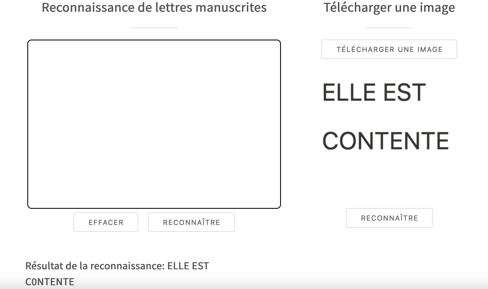
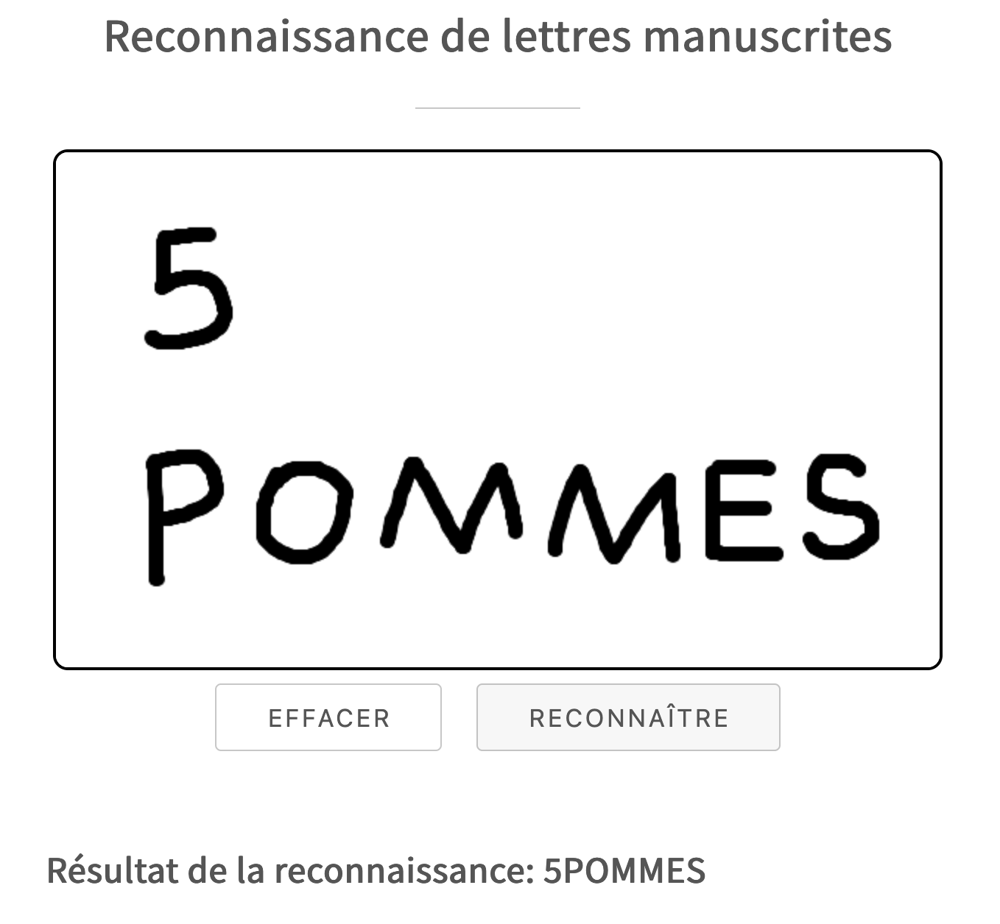
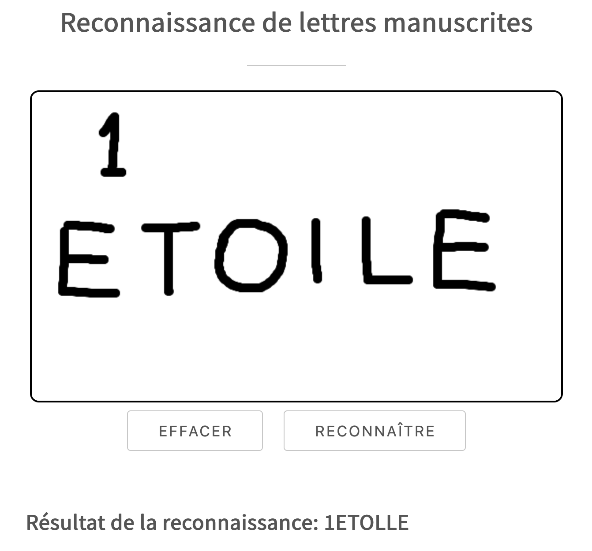

# Interfaces web pour le TAL & Réseaux de neurones

## Auteurs
- **CONG Jinyu**  (INALCO 43017468)
- **YANG Ke** (Nanterre 44017400) 
- **ZHANG Yu**  (Nanterre 43010766) 

---

## 1. Objectifs du projet  
L'objectif de notre projet est d'implémenter la **reconnaissance optique de caractères (OCR)** en connectant le **front-end web** avec le **back-end**.  
Les utilisateurs peuvent **écrire à la main** une série de lettres sur le site web ou **télécharger une image** contenant plusieurs caractères, puis cliquer sur un bouton pour obtenir le texte reconnu.

---

## 2. Description du projet  
Les données utilisées pour entraîner le modèle sont constituées **d'images de chiffres (0-9) et de lettres majuscules (A-Z)**.  
Ces images proviennent de **jeux de données open-source spécialisés en reconnaissance de caractères**, complétées par des **échantillons de données générés par ordinateur**.

### **Prétraitement des données**  
- Conversion en **niveaux de gris** et **binarisation** pour séparer les caractères du fond.  
- **Redimensionnement en 64x64 pixels** pour assurer la compatibilité avec le modèle.  
- **Normalisation et stockage sous forme de tenseurs** pour le traitement avec **PyTorch**.  

L’ensemble de données ainsi préparé permet d'entraîner un modèle capable de reconnaître différents styles d'écriture, bien que la précision dépende de la clarté des entrées manuscrites.

---

## 3. Méthodologie  

Dans le **back-end**, nous avons utilisé **LeNet**, un réseau de neurones d'apprentissage profond, pour entraîner des lettres majuscules et des chiffres arabes (0-9).  
Après **100 époques d'entraînement sur plus de 10 000 images**, nous avons obtenu une **précision de test de 88 %**.   
Après avoir enregistré les paramètres du modèle, il a été connecté à la page html frontale via l'interface **FastAPI** pour réaliser que les caractères manuscrits peuvent être écrits à la main et reconnus dans la page frontale. Étant donné que la formation utilise des caractères informatiques, les caractères manuscrits peuvent ne pas être très précis et nous devons essayer d'imiter la police d'écriture digitale afin de les identifier avec précision.

### **3.1 Répartition des tâches**  

#### **3.1.1 Développement du modèle**  
- **Préparation des données** : collecte, normalisation (conversion en niveaux de gris, binarisation, redimensionnement à 64x64 pixels).  
- **Entraînement du modèle** : utilisation de **LeNet**, optimisé avec **AdamW**, et fonction de perte **CrossEntropyLoss**.  
- **Validation et ajustements** : analyse des erreurs et amélioration de la précision.  

#### **3.1.2 Développement back-end**  
- Création d’une **API avec FastAPI**, définition des routes (`/predict`).  
- **Gestion des requêtes** : réception des images, prétraitement avec **OpenCV**, segmentation des caractères.  
- Intégration du modèle entraîné (`model.pth`) et retour des résultats sous **format JSON**.  

#### **3.1.3 Développement front-end**  
- **Interface interactive** avec **HTML, CSS, JavaScript** permettant :  
  - **Saisie manuscrite** via un canevas HTML.  
  - **Téléversement et collage d’images**.  
- **Communication avec l’API** via `fetch()`.  
- **Optimisation de l'expérience utilisateur**: gestion des erreurs et amélioration du design.  

### **3.2 Gestion de projet**  
- #### **Outils**  
  - **GitHub** : gestion du code source.  
  - **FastAPI** : développement du serveur.  
  - **PyTorch** : entraînement du modèle.  
  - **OpenCV** : prétraitement des images.  
  - **HTML/CSS/JavaScript** : interface utilisateur.  

- #### **Ressources**  
  - Tutoriels sur **FastAPI** et **PyTorch**.  
  - Jeux de données open-source en OCR.  

### **3.3 Résolution de problèmes**  

**a. Sélection du modèle**  
En ce qui concerne la sélection des modèles, nous avons d'abord opté pour **LeNet, AlexNet et ResNet**, par ordre décroissant de complexité. Finalement, nous avons choisi le modèle le plus simple, **LeNet**, qui donne également les meilleurs résultats en matière de reconnaissance.
  

**b. Segmentation des caractères**  
Nous avons d'abord utilisé une **projection des pixels**, mais cette méthode a échoué sur des écritures manuscrites variées.  
Nous avons amélioré la précision en intégrant **cv2.findContours (détection des contours)** et un **seuillage adaptatif**.  
L’ajout de **cv2.connectedComponents** a permis d'affiner la séparation des caractères.  

**c. Communication front-end/back-end**  
L’utilisation initiale de **Base64** pour transmettre les images augmentait inutilement leur taille.  
Nous avons optimisé l’échange via **FormData**, qui envoie directement les fichiers binaires à FastAPI.  
Pour éviter les erreurs de transmission, nous avons activé **CORS Middleware** et ajusté `fetch()` pour respecter le bon format.  

---

## 4. Résultats  

### **Interface web et fonctionnalités**  
L'interface permet d'envoyer une image à l’API pour analyse via **deux méthodes** :  
- **Écriture manuscrite** : Une zone de dessin HTML permet aux utilisateurs d’écrire directement des lettres ou des chiffres à l’aide de la souris ou d’un écran tactile. Une fois l’écriture terminée, ils peuvent cliquer sur un bouton pour envoyer l’image générée au serveur pour reconnaissance.  
- **Téléversement ou collage d’image** : Les utilisateurs peuvent téléverser une image depuis leur appareil ou coller une image directement dans une zone dédiée. L’aperçu de l’image apparaît immédiatement, puis elle est transmise au serveur pour analyse.  

Le **résultat s'affiche en temps réel**, immédiatement sous l’image.  

### **Exemples de reconnaissance**  

- #### **Image importée** → `ELLE EST CONTENTE`  

- #### **Saisie manuscrite** → `5 POMMES`  

- #### **Saisie manuscrite** → `1 ÉTOILE` (problème de confusion entre "I" et "L").  

Dans l’ensemble, l’interface web offre une interaction fluide et une connexion stable avec le modèle, avec un temps de réponse rapide. Cependant, certaines limites et améliorations potentielles seront détaillées dans la section suivante.

---

## 5. Discussion  

### **Succès**  
- **Reconnaissance correcte** des chiffres et lettres imprimées.  
- **Interface fluide**, interaction en temps réel avec l’API.  
- **Système modulaire**, extensible à d'autres types de caractères.  

### **Défis**  
- **Précision plus faible** sur certaines écritures manuscrites (ex. "0" vs "O", "I" vs "L").  
- **Segmentation des caractères imparfaite** sur certains cas.  
- **Difficulté avec certains styles d'écriture**.  

### **Perspectives**  
- Entraîner un **modèle plus avancé** (ResNet, MobileNet).  
- **Améliorer la segmentation** des caractères.  
- **Augmenter le jeu de données** pour plus de diversité.  

---

## **6. Installation & Usage**  

### **Prérequis**  
- **Python 3.11+**  
- **FastAPI, PyTorch, OpenCV, NumPy**  

### **Exécution**  
**a. Installer les dépendances**  
**b. Lancer le serveur FastAPI**: uvicorn server:app --host 0.0.0.0 --port 8000 --reload
**c. Ouvrir l'interface web**: Ouvrir `index.html` dans un navigateur.
**d. Tester l'API**
